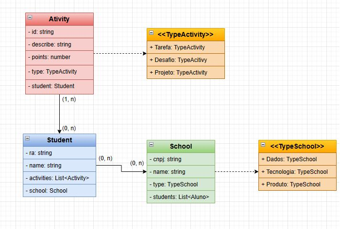

# Desafio de Engenharia de software PL
## Este desafio consiste no desenvolvimento de uma plataforma onde teremos um ranking baseado nas pontuações de entregas. Os alunos possuem Tarefas, Desafios e Projetos que são avaliados entre 0 e 100, e para cada uma destas atividades a ideia é ele receber uma pontuação com pesos diferentes de acordo com a sua pontuação. Os alunos são divididos em escolas de Dados, Tecnologia e Produto, deverá existir um ranking para cada escola.

    <h2>Modelo de Entidade relacional</h2>
    

    
Requisitos Funcionais

    

        <strong>Notas: </strong>
        <ul>
            <li>Como professor ou avaliador devo poder atribuir notas para cada aluno em diferentes tipos de atividades (Tarefas, Desafios, Projetos).</li>
            <li>As notas registradas devem estar associadas a alunos específicos e às atividades correspondentes</li>
            <li>O sistema deve permitir a especificação da pontuação para cada atividade, variando de 0 a 100</li>
        <ul>
    

    

        <strong>Pontuação: </strong>
        <ul>
            <li>O sistema deve calcular a pontuação de cada aluno com base nas notas atribuídas às atividades e nos pesos atribuídos a cada atividade.</li>
        <ul>
    

    

        <strong>Ranking Escolar: </strong>
        <ul>
            <li>Devo poder visualizar uma lista dos alunos divididos em três escolas diferentes: Dados, Tecnologia e Produto. De forma ordenada com base na pontuação.</li>
            <li>Cada ranking escolar deve exibir os 10 melhores alunos da escola correspondente.</li>
        <ul>
    

    

        <strong>Ranking Geral: </strong>
        <ul>
            <li>Devo poder visualizar um ranking com os 3 melhores alunos em uma categoria "pódio geral".</li>
        <ul>
    

    
Requisitos não funcionais

    

        <strong>Escalabilidade: </strong>
        <ul>
            <li>O sistema deve calcular a pontuação de cada aluno com base nas notas atribuídas às atividades e nos pesos atribuídos a cada atividade.</li>
        <ul>
    

    
Tecnologias utilizadas

    

        <strong>NodeJS: </strong>Para construção da API.
    

    

        <strong>AngularJS: </strong>Para construção da página WEB.
    

    

        <strong>MySQL: </strong>Para o banco de dados.
    

    

        <strong>Docker: </strong>Para a containerização.
    

    
Arquitetura do projeto

    

        
Definimos a utilização da arquitetura MVC neste projeto, para maior agilidade no desenvolvimento.

    

    <h3>Estrutura das pastas: </h3>
    

        <strong>/api: </strong>
        <ul>
            <li><strong>src/core: </strong>Pasta principal onde ficam as entities, repository, services e controller</li>
            <li><strong>src/data-mocked: </strong>Onde ficam os dados mockados na inicialização da API.</li>
            <li><strong>src/routes: </strong>Aqui são chamados os controllers e definidas suas rotas(url's)</li>
            <li><strong>src/utils: </strong>Pasta onde ficam os enums e tipagens de algumas requisições.</li>
        </ul>
    

    

        <strong>/web: </strong>
        <ul>
            <li><strong>src/app/components: </strong>Pasta onde ficam os componentes renderizados em outras telas na aplicação</li>
            <li><strong>src/app/core: </strong>Aqui estão as páginas da aplicação.</li>
            <li><strong>src/app/model: </strong>Guardamos a tipagens de algumas requisições que necessitam de tipagem.</li>
            <li><strong>src/app/services: </strong>Aqui ficam as funções que fazem a requisição direta para api</li>
            <li><strong>src/assets: </strong>Aqui ficam as imagens utilizadas.</li>
        </ul>
    

    

    
Rodando a aplicação:

    

        <strong>Clone o repositório com o comando: </strong>git clone https://github.com/silasprd/software-eng-pl-challenge
    

    

        <strong>Será necessário criar um banco de dados local para aplicação com o nome "dnc"</strong>
    

    

        <strong>Acesse a pasta api/src:</strong>Altere as informações de data-source.ts, para as informações do seu banco de dados, como username, password e port
    

    

        <strong>Acesse a pasta api e execute o comando:</strong>npm install
    

    

        <strong>Rode a api com o comando:</strong>npm start
    

    

        <strong>Acesse a pasta web e dentro da pasta web rode o comando:</strong>npm install
    
   
    

        <strong>Ainda dentro da pasta web, após a instalação das dependências rode o frontend com o comando:</strong>"npm start" ou "ng serve"
    
   

